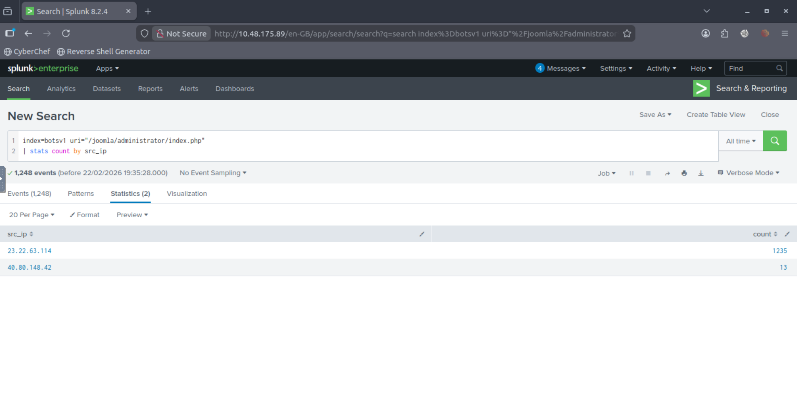
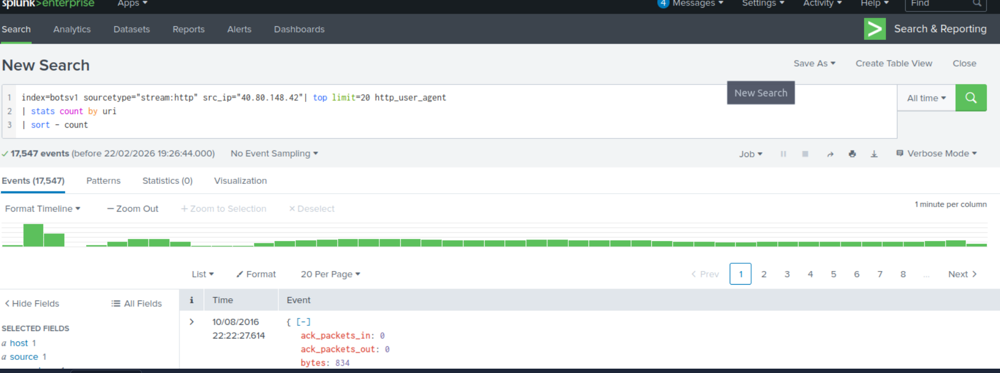
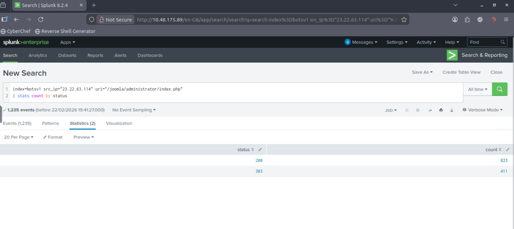
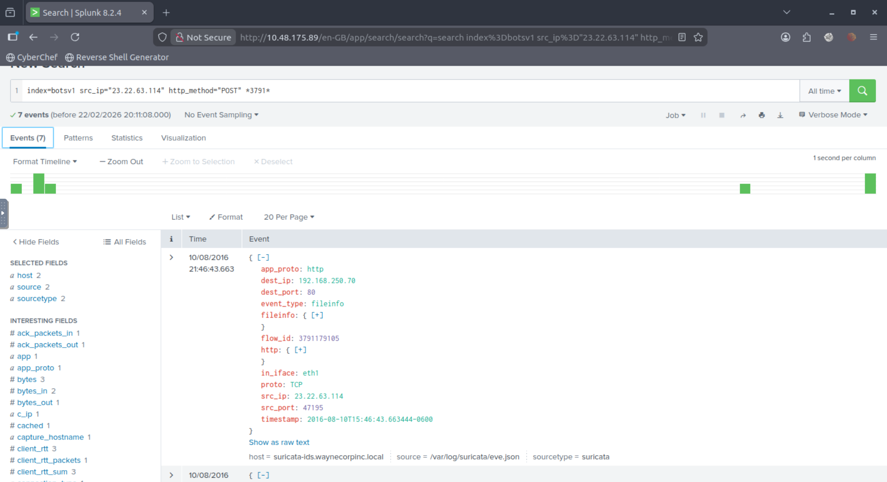

# Forensic Investigation: Adversary Tactics & Persistence Analysis

## 1. Executive Summary
This project is a detailed forensic reconstruction of a multi-vector unauthorized access event targeting a Joomla-facing web infrastructure. Leveraging Splunk Enterprise, I audited approximately 78,000 events within the BOTSv1 dataset to map the adversary's progression from initial reconnaissance to the deployment of persistent malicious artifacts.

## 2. Technical Profile
* Platform: Splunk Enterprise 8.2.4
* Investigation Framework: Lockheed Martin Cyber Kill Chain
* Target Environment: Wayne Enterprises (Internal IP: 192.168.250.70)

---

## 3. The Investigation Timeline

### Phase I: Reconnaissance & Infrastructure Mapping
The audit began by isolating external traffic interacting with administrative entry points. I identified two primary source IPs: 40.80.148.42 (Automated Scanning) and 23.22.63.114 (Directed Exploitation).

Further analysis of the scanning infrastructure revealed over 17,000 events utilizing the Acunetix vulnerability suite to map the application's attack surface.

### Phase II: Exploitation & Authentication Bypass
The adversary transitioned to a focused authentication attack targeting the /joomla/administrator/ login interface. 

* Volume: 1,235 unique login attempts were recorded.
* Confirmation of Breach: I identified 411 HTTP 303 Redirects. In the Joomla architecture, a 303 status following a login POST request serves as technical confirmation of a successful administrative session.

### Phase III: Credential Harvesting & Post-Exploitation
Following the breach, I performed a deep-packet inspection of the form_data field to isolate the compromised account and the attacker's toolkit.

* Compromised Identity: admin
* Methodology: Automated password spraying utilizing specialized wordlists.

Once access was secured, the actor initiated a series of administrative POST requests to modify system configurations.

### Phase IV: Persistence via Malicious Payload
The final stage of the investigation focused on identifying the persistence mechanism. I isolated the upload of the `3791.zip` artifact, which was deployed via a Python-based delivery script to establish a persistent Web Shell for remote command execution.

---

## 4. Mitigation & Strategic Defense
1. Administrative Hardening: Enforce Multi-Factor Authentication (MFA) for all CMS backend access to negate credential-based ingress.
2. Access Control Policies: Implement strict account lockout thresholds to disrupt automated brute-force tools.
3. Perimeter Filtering: Deploy a Web Application Firewall (WAF) to filter known vulnerability scanner signatures and anomalous POST request volumes.
